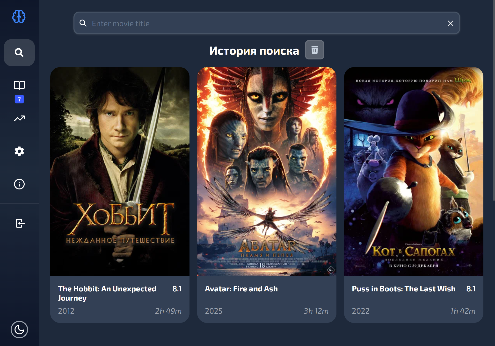

# 🎬 Eni

**Eni** — веб-приложение для просмотра и перевода субтитров к фильмам  
с возможностью сохранять слова и фразы в личный словарь.

Проект создан как pet-project для прокачки full-stack навыков  
(React + Node.js + PostgreSQL).

---

## 🚀 Возможности

- 📄 Просмотр субтитров к фильмам
- 🔤 Перевод отдельных слов
- 🧩 Перевод фраз и предложений
- ⭐ Сохранение слов и выражений в профиль
- 🔐 Регистрация и авторизация пользователей
- 🔔 Уведомления о действиях
- 📱 Адаптивный современный интерфейс

---

## 🛠️ Технологический стек

### 🎨 Frontend
- **React** — UI
- **React Router DOM** — маршрутизация
- **Redux Toolkit** — глобальное состояние
- **React Query** — серверное состояние и кэширование
- **React Hook Form + Zod** — формы и валидация
- **SCSS** — стилизация

#### UI / UX
- **React Hot Toast** — уведомления
- **React Loading Skeleton** — скелетоны
- **React Intersection Observer** — ленивая загрузка
- **SVGR** — SVG как React-компоненты

---

### ⚙️ Backend
- **Node.js + Express**
- **PostgreSQL** — база данных
- **Prisma** — ORM
- **JWT** — аутентификация
- **Bcrypt** — хеширование паролей
- **Nodemailer** — email-уведомления
- **Inversify** — Dependency Injection
- **Axios** — HTTP-клиент

---

### 🧪 Тестирование
- **Vitest** — frontend
- **Jest** — backend

---

### 🔧 Инструменты разработки
- **TypeScript**
- **ESLint**
- **Stylelint**
- **Prettier**

---

## 🌐 Внешние API

- **OpenSubtitles** — загрузка субтитров  
  https://opensubtitles.stoplight.io/docs/opensubtitles-api

- **Yandex Dictionary** — перевод слов  
  https://yandex.ru/dev/tech-only/doc/dg/ru/

- **Yandex Translate** — перевод текста  
  https://yandex.cloud/ru/docs/translate/quickstart

---

## 🖼️ Скриншоты

### 🔍 Поиск фильмов

